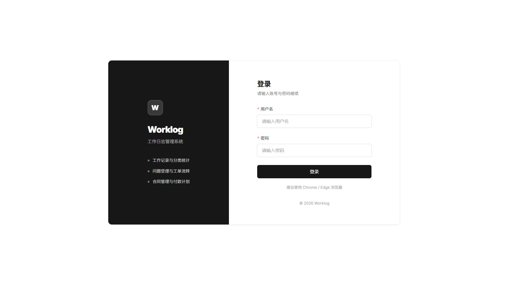
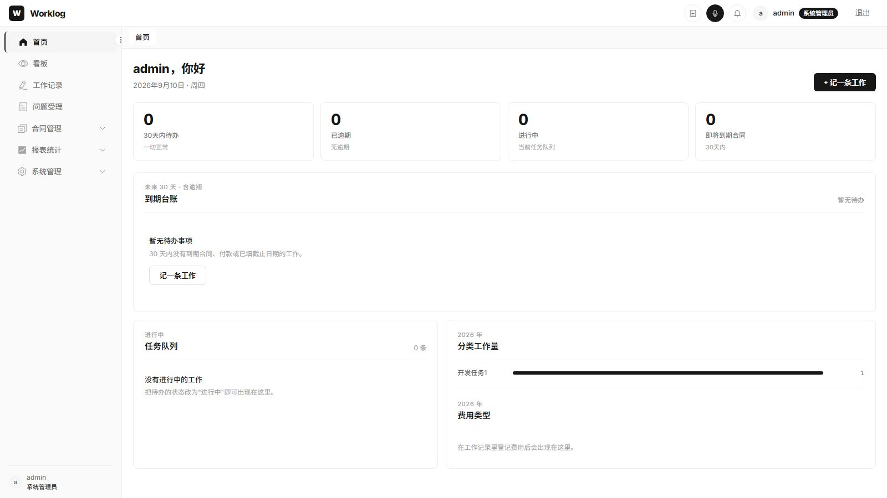
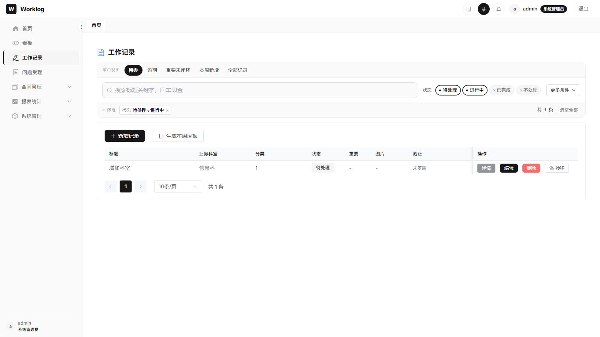
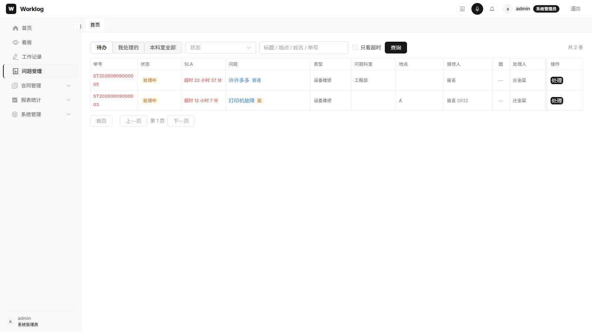
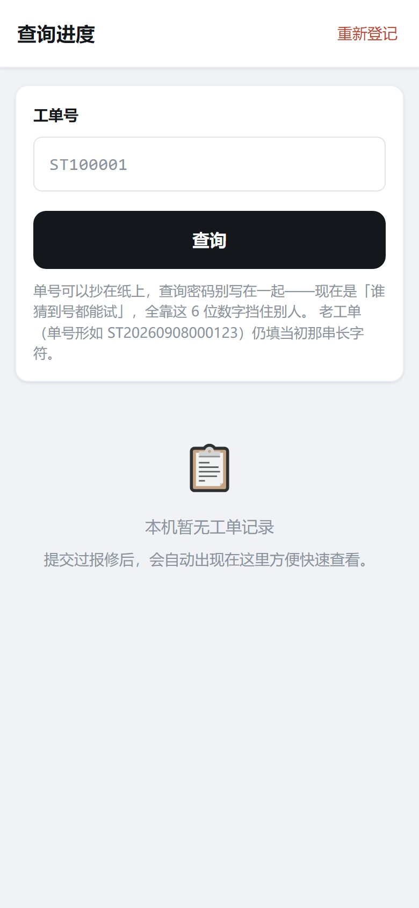

# 工作日志管理系统

Spring Boot 3 + Vue 3 的企业内部工作记录平台：日常工作记录、任务看板、供应商与合同、以及手机扫码报修（服务工单）。

[](https://www.oracle.com/java/)
[](https://spring.io/projects/spring-boot)
[](https://vuejs.org/)
[](LICENSE)

## 项目简介

系统按「员工产出」和「外部请求」拆开：工作记录是员工自己的任务与工作量；服务工单是报修人扫码提交的问题，受理后可转成工作记录，再进入看板与统计。

身份是三级内置角色（`user.role`），不另建 RBAC 表。权限点可在管理端「只收紧、不放宽」。生产形态是前端 `dist` 与后端同域部署；手机端 H5 走公开路径 `/m/**`，免登录。

### 主要能力

- **工作记录**：创建 / 编辑 / 查询 / 删除，日志、费用、任务转移与审批
- **任务看板**：按本人 / 本科室 / 全部科室查看任务（后两档受权限点控制）
- **工作分类**：按科室维护分类，支持填写模板
- **服务工单**：扫码免登录登记、受理台流转、转工作记录、报修人凭单号+查询密码看进度
- **供应商 / 合同**：供应商与联系人、合同生命周期、付款计划与到期提醒
- **报表**：工作量分类统计（ECharts），跨科室筛选受权限控制
- **系统管理**：科室树、员工、人员角色、参数配置、权限设置、登记渠道（二维码）
- **文件**：阿里云 OSS 直传；手机拍照走访客 policy
- **认证**：JWT；口令 BCrypt（存量明文启动时迁移）

## 项目截图

登录页



首页



工作记录



问题受理台



手机端进度查询（免登录）



## 技术栈

### 后端

| 技术 | 版本 | 说明 |
|------|------|------|
| JDK | 17+ | 运行与编译 |
| Spring Boot | 3.5.10 | Web / Validation / Security |
| MyBatis | 3.0.3 | ORM |
| MySQL | 8.0+ | 数据存储 |
| JWT (jjwt) | 0.11.5 | 无状态登录 |
| Maven | 3.6+ | 构建 |

### 前端

| 技术 | 版本 | 说明 |
|------|------|------|
| Vue | 3.5.24 | 管理端 + 手机 H5 |
| Vite | 7.2.4 | 开发与打包 |
| Element Plus | 2.13.2 | 管理端 UI |
| Vue Router | 4.6.4 | History 模式 |
| Axios | 1.13.4 | 请求；开发态经 Vite 代理 `/api` |
| ECharts | 6.0.0 | 首页与报表 |
| XLSX | 0.18.5 | Excel 导出 |

## 环境要求

- JDK 17+
- Node.js 20+（Vite 7）
- Maven 3.6+
- MySQL 8.0+
- 使用附件时：阿里云 OSS Bucket 与 AccessKey

## 快速开始

### 1. 克隆

```bash
git clone https://github.com/zhuangj1945/worklogApp.git
cd worklogApp
```

### 2. 建库并执行脚本

```sql
CREATE DATABASE IF NOT EXISTS work_log_system
  DEFAULT CHARACTER SET utf8mb4 COLLATE utf8mb4_unicode_ci;
```

`work_record_module.sql` 里也会 `CREATE DATABASE IF NOT EXISTS`。其余脚本假定库已存在，按顺序执行：

```bash
# 用户、科室、工作记录 / 分类 / 状态 / 日志 / 费用 / 转移
mysql -u root -p work_log_system < src/main/resources/db/work_record_module.sql

# 工作分类填写模板列（已有库升级时执行）
mysql -u root -p work_log_system < src/main/resources/db/work_category_template.sql

# 供应商、合同、付款计划
mysql -u root -p work_log_system < src/main/resources/db/contract_module.sql

# 系统参数（含工单表单规则、限流、流转等预置项）
mysql -u root -p work_log_system < src/main/resources/db/sys_config_module.sql

# user.role 列；启动时 UserRoleMigrationRunner 也会补列并把 username=admin 升为 ADMIN
mysql -u root -p work_log_system < src/main/resources/db/user_role_module.sql

# 权限点种子（可选；未执行则按代码内置下限运行）
mysql -u root -p work_log_system < src/main/resources/db/permission_module.sql

# 登记渠道、服务工单、工单流转日志
mysql -u root -p work_log_system < src/main/resources/db/service_ticket_module.sql
```

脚本均无外键，表之间是逻辑关联。

### 3. 后端配置

仓库里的 `application.yml` 可能被忽略或不适合本机。复制模板：

```bash
cp src/main/resources/application.yml.example src/main/resources/application.yml
```

至少配置：

| 项 | 说明 |
|----|------|
| `spring.datasource.*` | 本机开发建议 `127.0.0.1`。不要用本机公网 IP 回连 MySQL（云安全组常丢这种流量） |
| `MYSQL_PROD_USER` / `MYSQL_PROD_PASS` | 数据库账号 |
| `JWT_SECRET` | **必填**，≥32 字节随机串；不合格会直接拒绝启动（`JwtProps`） |
| `ALIYUN_OSS_ACCESS_KEY_ID` / `SECRET` | 上传附件时必填 |
| `cors.allowed-origins` | 留空 = 只允许同源（当前推荐）。H5 与 API 不同域时再配 |

生成 JWT 密钥：

```powershell
# PowerShell
-join ((48..57)+(97..122) | Get-Random -Count 48 | ForEach-Object {[char]$_})
```

```bash
# Linux / macOS
openssl rand -base64 48
```

经 Nginx 反代时保持 `server.forward-headers-strategy: framework`，后端只监听本机，由 Nginx 对外；否则客户端可伪造 `X-Forwarded-For` 绕过手机端 IP 限流。

### 4. 启动后端

```bash
mvn spring-boot:run
# 或
mvn clean package
java -jar target/worklog-0.0.1-SNAPSHOT.jar
```

默认 `http://localhost:8080`。

### 5. 启动前端（开发）

```bash
cd web
npm install
npm run dev
```

默认 `http://localhost:5173`。`/api` 由 Vite 代理到 `8080`。开发机需被手机访问时，`vite.config.js` 已 `host: true`；渠道二维码会尽量写成局域网 IP，避免码里出现 `localhost`。

### 6. 首次登录

脚本**不会**插入管理员账号。在 `user` 表插入一条记录，`username` 建议为 `admin`（启动迁移会把它升为 `ADMIN`）。口令可先写明文，`PasswordMigrationRunner` / 登录路径会升级为 `{bcrypt}`。

管理端：`http://localhost:5173/login`  
手机登记：`http://localhost:5173/m/{渠道编码}`（需先在「登记渠道维护」建渠道）  
进度查询：`http://localhost:5173/m/query`

## 功能模块

侧栏与路由一致。菜单隐藏只是体验层，接口仍由服务端收口。

### 首页 `/home`

今日待办、进行中任务、合同/付款到期提醒、工作量与费用图表。

### 看板 `/board`

按范围看任务；「本科室」「全部科室」分别对应权限点 `board.scopeDept`、`board.scopeAll`。本科室他人记录能否编辑由 `record.editDeptOthers` 决定，删除始终仅本人。

### 工作记录 `/work-records`

记录 CRUD、分类与状态、处理日志、费用、任务转移。分类可带新建模板。

### 问题受理（服务工单）

| 页面 | 路径 | 说明 |
|------|------|------|
| 问题受理台 | `/tickets` | 待办、派单、回复、完成、退回、归档；可转工作记录 |
| 工单处理 | `/tickets/:id` | 详情（不进侧栏） |
| 登记渠道 | `/ticket-channels` | 一码一渠道，绑定受理科室；停用后旧码立即失效 |
| 手机登记 | `/m/:channelCode` | 免登录；form token + 多维限流 + 蜜罐 |
| 进度查询 | `/m/query`、`/m/ticket/:ticketNo` | 单号 + 自设 6 位查询密码 |

状态由代码枚举固定（不做可编辑字典）：待受理 → 处理中 → 待报修人确认 → 已完成 / 已关闭 / 已退回。报修人超时未确认可由定时任务自动确认（参数配置「工单流转」，默认 8 小时）。工单受理与流转的角色门槛是权限点 `ticket.manage`（内置下限 USER，可调高）。

### 供应商与合同

供应商编码、联系人；合同类型与状态流转（启动 / 完成 / 终止 / 续签）、付款计划、到期提醒。选负责人走 `GET /api/users/roster`（仅 id / 用户名 / 姓名 / 科室），不是员工管理分页接口。

### 报表 `/reports/workload-category`

按分类、用户、科室统计工作量。跨科室筛选：`report.deptCross`。

### 系统管理

| 页面 | 最低角色（可再收紧） | 说明 |
|------|----------------------|------|
| 科室管理 | ADMIN | 多级树 |
| 员工管理 | ADMIN | 账号增删改、启用停用；不能改自己的角色/状态；系统至少保留一名启用 ADMIN |
| 人员角色设置 | ADMIN | 行内改角色、批量授予；改完对方需重新登录 |
| 工作分类维护 | DEPT_ADMIN | 分类与模板 |
| 登记渠道维护 | DEPT_ADMIN | 二维码 |
| 参数配置 | ADMIN | `sys_config`（上传、限流、工单表单与流转等）；不含 permission 分组 |
| 权限设置 | ADMIN（固定） | 见下一节 |

## 角色与权限

三级角色存在 `user.role`，随 JWT 签发；**改角色需对方重新登录**。`GET /api/auth/me` 的 `roleStale` 用于提示旧 token。无 role claim 的旧 token 一律按 `USER`。

| 能力 | USER | DEPT_ADMIN | ADMIN |
|------|------|------------|-------|
| 本人工作记录 | 读写 | 读写 | 读写 |
| 本科室工作记录 | 只读（看板「本科室」） | 默认可改他人、不可删除 | 可改他人 |
| 跨科室（看板「全部」、报表选科室） | ✗ | ✗ | ✓ |
| 工作分类 / 登记渠道 | 只读 | 可维护 | 可维护 |
| 科室 / 员工与角色 / 参数 / 权限页 | ✗ | ✗ | ✓ |

两层收口不要混用：

1. **接口门槛**：`@RequireRole(最低角色)`，语义是「不低于」；可再挂 `permission`。不写注解 = 任意登录用户。公开接口只有登录、静态资源、`/m/**`、`/api/public/**`。
2. **数据行级**：`DataScope` 判断这条记录能不能看 / 改。常见模式：读放宽、写收紧。

「权限设置」只调整**已经存在的收口点**要多高的角色，不能凭空开门。每个权限点有内置下限 `floor`，配置更松会被 `clamp()` 抬回，响应里的 `adjusted` 会标明。存储复用 `sys_config`（`config_group = permission`）。读库失败回落内置下限。改完服务端立即生效，其他人已打开的页面需刷新。

| 权限点 | 内置下限 | 控制内容 |
|--------|----------|----------|
| `user.manage` | ADMIN | 员工与角色 |
| `dept.manage` | ADMIN | 科室 |
| `sysConfig.manage` | ADMIN | 参数配置 |
| `permission.manage` | ADMIN（不可调） | 权限设置本身 |
| `workCategory.manage` | DEPT_ADMIN | 工作分类 |
| `ticketChannel.manage` | DEPT_ADMIN | 登记渠道 |
| `ticket.manage` | USER | 工单受理与流转、转工作记录 |
| `board.scopeDept` | USER | 看板/列表「本科室」 |
| `board.scopeAll` | ADMIN | 「全部科室」 |
| `report.deptCross` | ADMIN | 报表跨科室 |
| `record.editDeptOthers` | DEPT_ADMIN | 编辑本科室他人记录 |

清单以 `security/Permission.java` 为准。前端用 `web/src/utils/auth.js` 的 `can(权限点, [内置下限])` 画菜单和按钮；配置拉失败时退回声明的下限。

相关接口：`GET /api/permissions`（登录可读）、`PUT /api/permissions`、`POST /api/permissions/reset`。角色接口：`GET /api/users/role-page`、`GET /api/users/role-summary`、`PUT /api/users/{id}/role`、`PUT /api/users/roles/batch`。保护逻辑在 `UserRoleGuard`。

不变量单测：`PermissionTest`、`DataScopeTest`、`UserRoleGuardTest`，以及工单相关 `Ticket*Test`。改枚举后若测试报数量不一致，同步本节表格。

```bash
mvn test
```

## 项目结构

```
worklog/
├── docs/screenshots/                  # README 截图
├── src/main/java/com/zjl/worklog/
│   ├── auth/                          # 登录、/auth/me
│   ├── common/                        # 统一响应与异常
│   ├── config/                        # 系统参数 sys_config
│   ├── contract/                      # 合同
│   ├── dept/                          # 科室
│   ├── oss/                           # OSS 直传、签名 URL、访客 policy
│   ├── security/                      # JWT、角色、权限、CORS、SPA 兜底、口令迁移
│   ├── supplier/                      # 供应商
│   ├── ticket/                        # 服务工单、公开登记、渠道、限流、定时确认
│   ├── user/                          # 员工与角色
│   └── work/                          # 工作记录、分类、看板统计
├── src/main/resources/
│   ├── application.yml.example        # 配置模板
│   ├── db/                            # 分模块 SQL
│   └── mapper/                        # MyBatis XML
├── src/test/java/                     # 权限、工单、口令等单测
├── web/
│   ├── src/api/                       # 接口封装（baseURL 为 /api）
│   ├── src/components/
│   ├── src/router/                    # 管理端 + /m 公开路由
│   ├── src/utils/                     # 权限、OSS、工单表单校验等
│   └── src/views/                     # 管理端页面；views/m 为手机 H5
└── pom.xml
```

Vue Router 为 History 模式。同进程托管前端时，`SpaFallbackController` 把无后缀路径转到 `index.html`，`/api/**` 不会被当成页面。前端由 Nginx 单独发布时，history 回退应在 Nginx 配置。

## 配置要点

模板：`src/main/resources/application.yml.example`。敏感项只走环境变量。

```yaml
server:
  port: 8080
  forward-headers-strategy: framework

spring:
  datasource:
    url: jdbc:mysql://127.0.0.1:3306/work_log_system?...
    username: ${MYSQL_PROD_USER:}
    password: ${MYSQL_PROD_PASS:}
  servlet:
    multipart:
      max-file-size: 5MB          # 生产可按拍照原图调大；参数配置页也可调
      max-request-size: 30MB

jwt:
  secret: ${JWT_SECRET:}          # 必填，启动校验
  expire-seconds: 28800           # 8 小时；过期前端 401 回登录

cors:
  allowed-origins: ${CORS_ALLOWED_ORIGINS:}

aliyun.oss:                       # AccessKey 仅环境变量
ticket.rate:                      # 手机登记防刷；也可被 sys_config 覆盖
logging.level:                    # 启动默认 INFO；运行期在「参数配置 → 日志级别」改，立刻生效
```

前端开发不写死后端绝对地址。生产同域时继续用相对路径 `/api`。

## 常见问题

**数据库连不上**  
确认 MySQL 已启动、库名与账号正确。应用与库同机时用 `127.0.0.1`，不要用公网 IP 回连。

**启动失败：jwt.secret 未配置**  
设置 `JWT_SECRET`（≥32 字符，且不能是 `change-me` 前缀）。

**Token 过期**  
默认 8 小时。可改 `jwt.expire-seconds` 或参数配置里的登录有效期；改完需重新登录。

**前端调不到后端**  
开发：后端 8080、前端 5173，代理 `/api`。生产：同域或配置 `CORS_ALLOWED_ORIGINS`。看浏览器控制台与 Network。

**直接打开 `/work-records` 或 `/m/xxx` 404**  
History 路由需要 SPA 回退（后端 `SpaFallbackController` 或 Nginx `try_files`）。

**上传失败**  
检查 OSS 环境变量、Bucket、权限与网络。手机原图较大时确认 multipart 与参数配置中的体积上限。

**改了角色菜单没变**  
对方必须重新登录。权限点改完，已打开页面刷新一次。

**找不到主类 `WorklogApplication`**

```bash
mvn clean package
```

## 安全建议

- 生产用环境变量提供 JWT、数据库、OSS；不要把真实 `application.yml` 提交进库
- 后端若信任转发头，只应监听本机并由反向代理对外
- 公开登记接口依赖限流与一次性 form token，不要把渠道密钥打进二维码
- 定期备份 MySQL；依赖保持更新

## 开发约定

- 后端统一 `ApiResponse`；业务错误走全局异常处理
- 新增前端一级路径时，确认 Security 放行列表（公开页）或登录守卫（管理页）
- 新增权限点：改 `Permission` 枚举、权限页会自动列出，并补单测数量
- 提交说明建议：`feat` / `fix` / `docs` / `refactor` / `test` / `chore`

```bash
git commit -m "feat: 工单超时自动确认"
```

## 许可证与反馈

[MIT License](LICENSE)。问题与建议请提 [Issue](https://github.com/zhuangj1945/worklogApp/issues)。

## 现状摘要（相对早期版本）

当前代码已包含：三级角色与可配置权限、系统参数页、服务工单（手机 H5 + 受理台 + 渠道二维码）、口令 BCrypt 与 JWT 启动校验、CORS 白名单、工单限流与自动确认。版本号仍为 `0.0.1-SNAPSHOT`。
